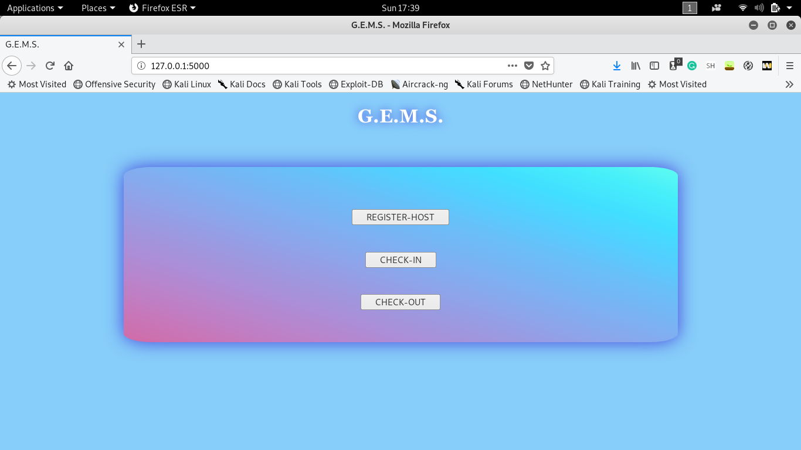
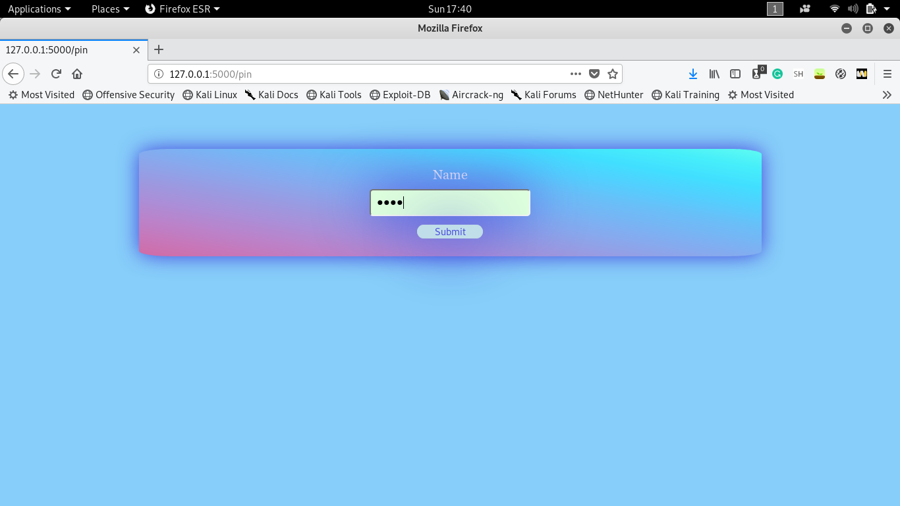
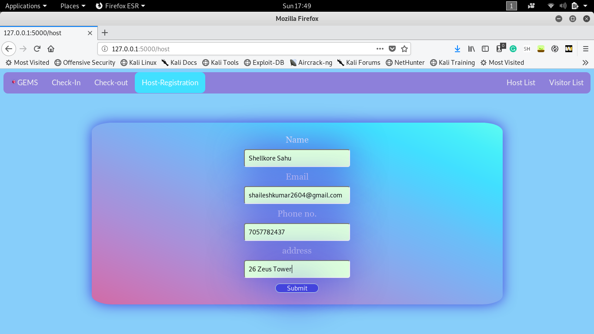
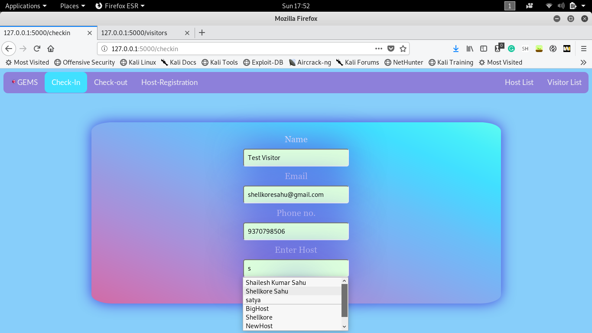
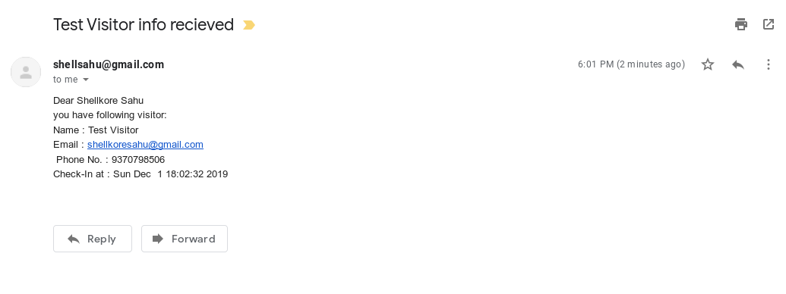
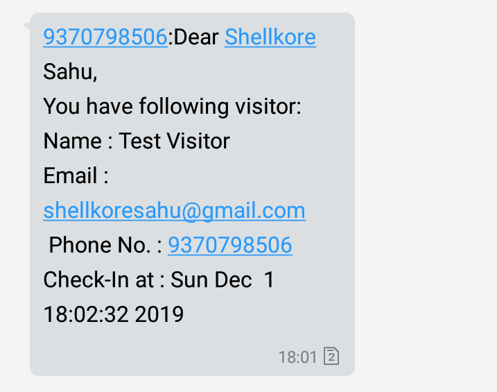
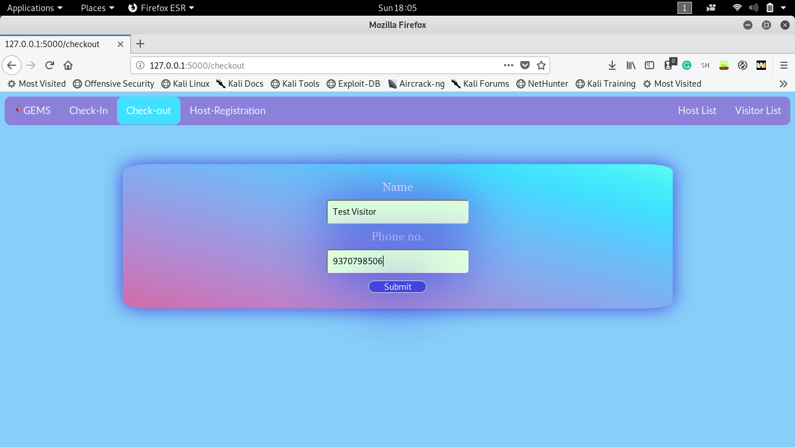
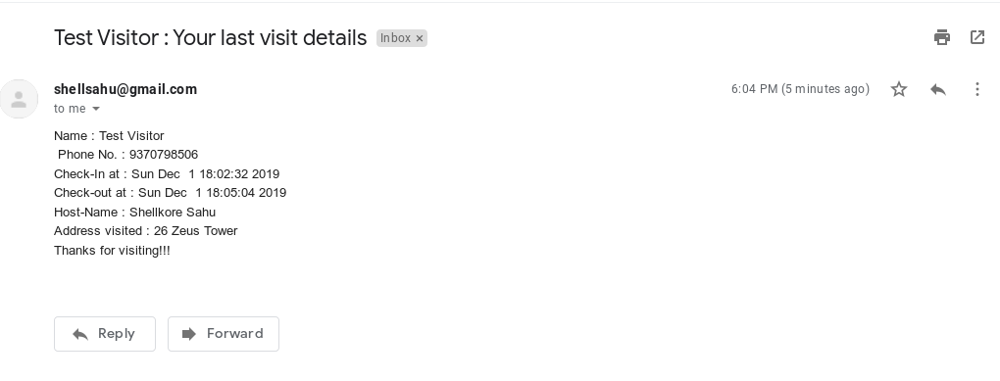
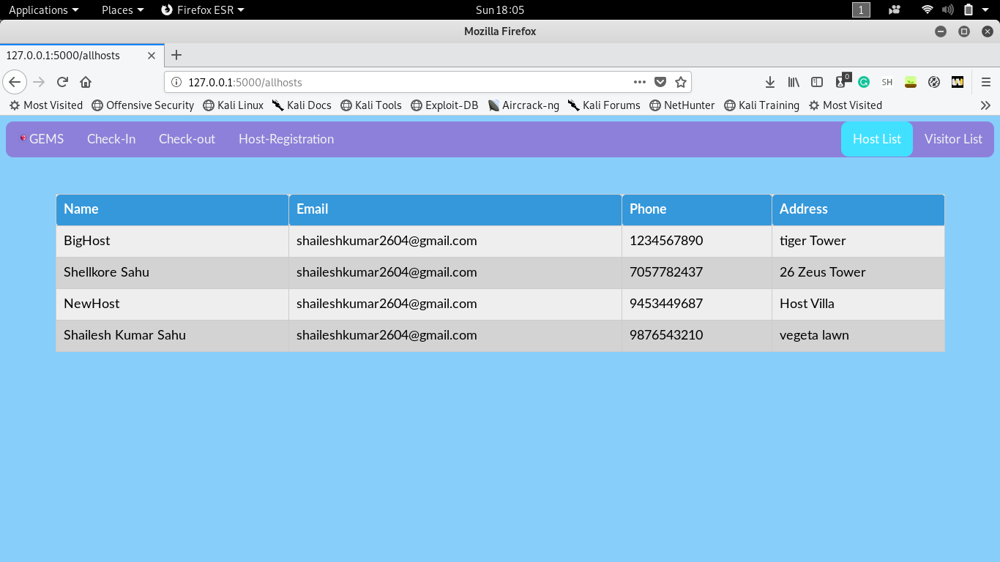
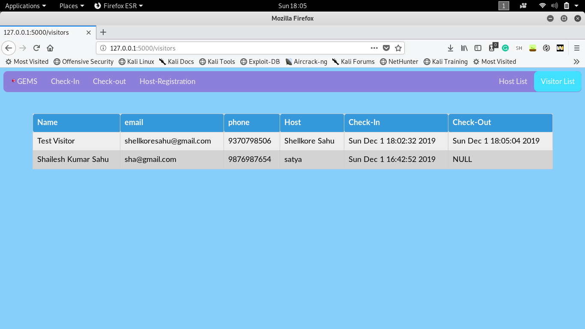

# GEMS - General-Entry-Management-Software

## TABLE OF CONTENT
+ [Description](https://github.com/shellkore/entry-management-software#description)
+ [Features](https://github.com/shellkore/entry-management-software#description)
+ [Requirements](https://github.com/shellkore/entry-management-software#requirements)
+ [How to run](https://github.com/shellkore/entry-management-software#how-to-run)
+ [Workflow](https://github.com/shellkore/entry-management-software#workflow)
+ [Approach](https://github.com/shellkore/entry-management-software#approach)
+ [Repo-Description](https://github.com/shellkore/entry-management-software#repo-description)
	

## DESCRIPTION
This is an entry management software built on flask. This is made for the purpose of innovacer summergeeks-SDE.

Live Link deployed on heroku [here](https://ems-shellkore.herokuapp.com)

## FEATURES
+ Host can register itself with name, mail, phone no. and address.
+ Visitor have two options - check-in and check-out
+ In check-in option the user details to be provided are: name, email, phone and host which he/she is visiting.
+ Visitor's details are added in Database along with it's entry timestamp as checkin time.
+ As soon as visitor check-in, a **mail and a SMS to the corresponding host** is sent of the arrival.
+ On leaving the place, visitor do check-out. Details to be provided are name and phone no. only.
+ As soon as visitor do check-out, a **mail to the visitor** is sent of all his details along with the address of host he/she visited.
+ List of Hosts and Visitors with their corresponding info can be viewed any time.

## REQUIREMENTS
+ install all requirements from requirement.txt

	`pip3 install -r requirements.txt`
+ you have to setup Mailer and SMS sender. You will be asked to enter these details when you run app for first time.

	+ Select one of your Gmail account as admin mail. [Allow less secure apps](https://devanswers.co/allow-less-secure-apps-access-gmail-account/) for this mail-id.

	+ Create a account on fast2sms.com and get your API key from [here](https://www.fast2sms.com/dashboard/dev-api)

## HOW TO RUN

Make sure you have all the requirements installed mentioned above.

+ run createDB.py to create database.
  `python3 createDB.py`
+ run app.py
  `python3 app.py`
+ open browser and enter `127.0.0.1:5000`
+ Rest is self-explanatory

## WORK-FLOW

+ Home

+ Click on Host to register host. You need to enter PIN.(Default pin is "9876")

+ To add a host

+ To check in by visitor. Host list is **automatically populated and searchable at the same time**.

	

+ Mail sent to Host

+ SMS sent to Host

+ To check-out by visitor

+ Mail sent to the visitor about his visit

+ Host List with details

+Visitor List with details

## APPROACH

1. **Front-End** made using HTML/CSS. These files are kept in templates folder for flask to read them. The forms made consist of corresponding field:
	+ Register a Host by entering following details.
		+ First You would be asked to enter PIN.
		+ Name : any type of text is allowed
		+ Email : only valid emails can be entered.
		+ Phone : Phone no. of 10 digits and only starting from 9,8,7,6 are allowed (from indian standards).
		+ Address : Any text is allowed
	+ Visitor Check-In
		+ Name : any type of text is allowed
		+ Email : only valid emails can be entered.
		+ Phone : Phone no. of 10 digits and only starting from 9,8,7,6 are allowed (from indian standards).
		+ Host : This list is **automatically populated by reading from database and is searchable**.
	
1. Database is designed in sqlite3. There are two tables.
	+ Host : 
		+ name TEXT,
		+ email TEXT, 
		+ phone INTEGER NOT NULL PRIMARY KEY,
		+ address TEXT
	+ Visitor :
		+ name TEXT, 
		+ email TEXT, 
		+ phone INTEGER NOT NULL PRIMARY KEY, 
		+ host TEXT,
		+ checkin TEXT, 
		+ checkout TEXT

1. **Flask**: this front-end is connected with database with the help of Flask app created in python. The routes created in Flask are:
	+ @app.route('/',methods = ['GET']) : for landing on home page.
	+ @app.route('/pin',methods= ['GET','POST']) : for entering pin to procede to host-registration page.
	+ @app.route('/host',methods = ['POST', 'GET']) : for host registration.
	+ @app.route('/checkin',methods = ['POST', 'GET']) : for check-in.
	+ @app.route('/checkout',methods = ['POST', 'GET']) : for check-out.
	+ @app.route('/allhosts') : to view all hosts
	+ @app.route('/visitors') : to view all visitors
	Also there are 3 functions:
		+ sendSmsToHost(name,email,phone,checkin,hostName) : to send sms to host when visitor checks in.
		+ sendMailToHost(name,email,phone,checkin,hostName) : to send mail to host when user checks in.
		+ sendMailToVisitor(name,phone) : to mail visitor their detail when they do check-out.
		+ There is also a try-catch block which checks for the credential files. These files have password and API-key for sending mail and sms respectively. If there is no file(in case of using app for first time), you will be asked to enter details and the file would be created.

## REPO-DESCRIPTION
+ images : contains images for work-flow.
+ static : contain CSS file for styling and image for icon.
+ templates : contains all HTML files.
+ .gitignore : contains name of file which contains info which can't be exposed to public. eg: API authentication keys and password.
+ Procfile : contains server info. required for deploying on Heroku.
+ README.md : Contains documentation.
+ app.py : main file of the project. Contains flask app code in it.
+ createDB.py : this file is required to create DB in sqlite3 at the beginning.
+ database.db : contains Sqlite3 data. All information entered is saved in this file.
+ requirements.txt : requirements means all the libraries required for running our program.
+ smsSender.py : python file to send sms to host.

>This is made for the purpose of internship selection task only. Please don't create issues and send PRs. Thanks.
