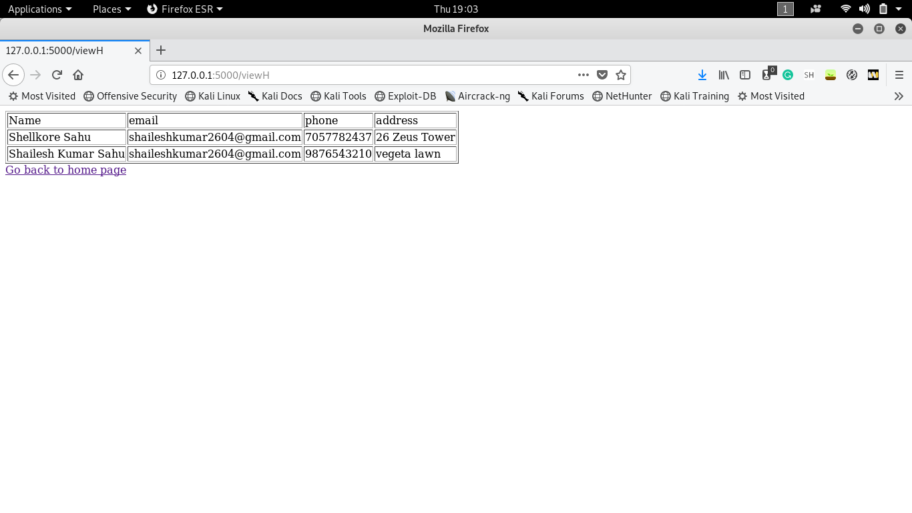
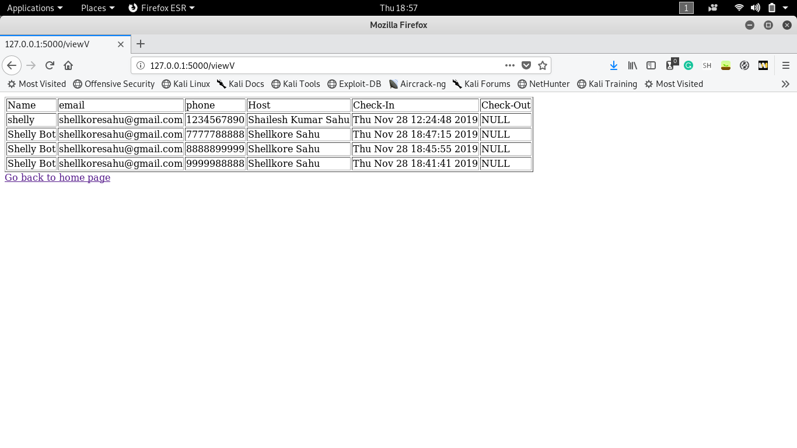
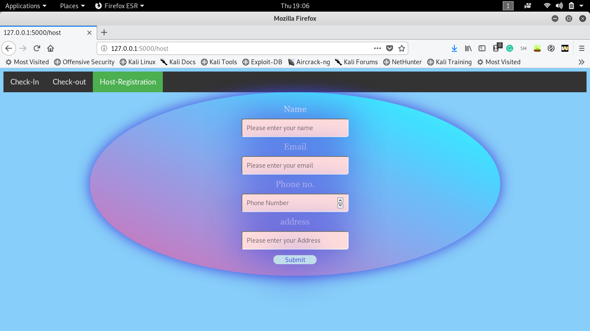
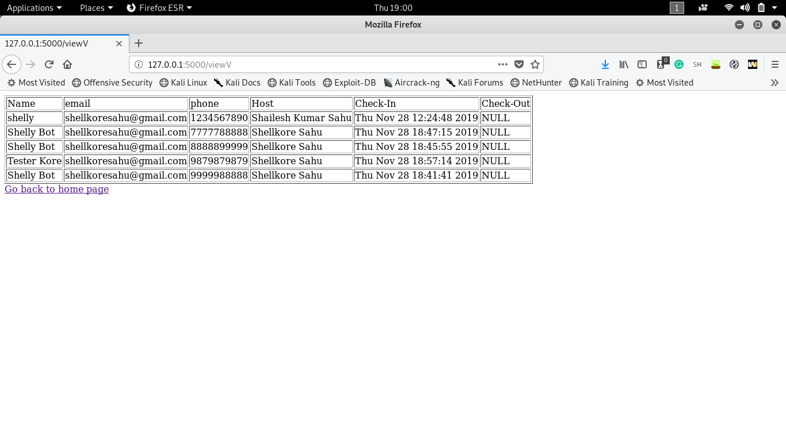
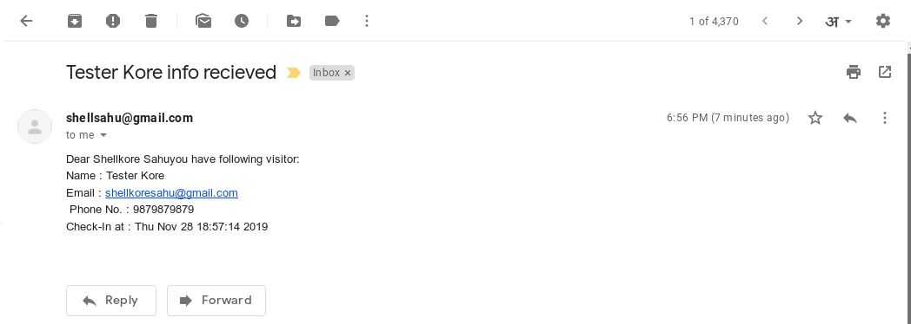
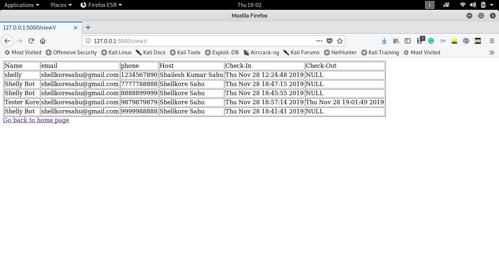
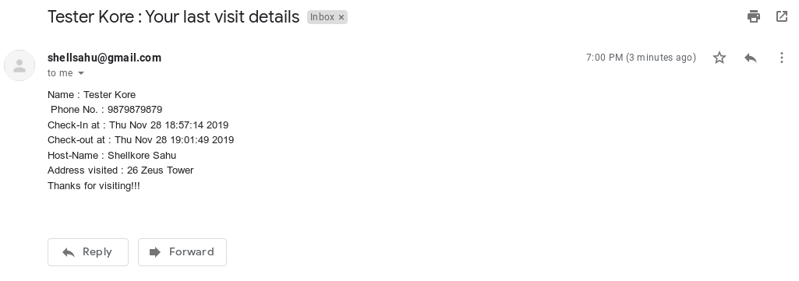

# entry-management-software

## DESCRIPTION
This is an entry management software built on flask. This is made for the purpose of innovacer summergeeks-SDE.

Live Link deployed on heroku [here](https://ems-shellkore.herokuapp.com)

## FEATURES
+ Host can register itself with name, mail, phone no. and address.
+ Visitor have two options - check-in and check-out
+ In check-in option the user details to be provided are: name, email, phone and host which he/she is visiting.
+ Visitor's details are added in Database along with it's entry timestamp as checkin time.
+ As soon as visitor check-in, a **mail and a SMS to the corresponding host** is sent of the arrival.
+ On leaving the place, visitor do check-out. Details to be provided are name and phone no. only.
+ As soon as visitor do check-out, a **mail to the visitor** is sent of all his details along with the address of host he/she visited.
+ You can view Database (hosts and visitors) by '/viewH' and 'viewV' links.

## REQUIREMENTS
install all requirements from requirement.txt

`pip3 install -r requirements.txt`

## HOW TO RUN

Make sure you have all the requirements installed mentioned above.

+ run app.py
  `python3 app.py`
+ open browser and enter `127.0.0.1:5000`
+ Rest is self-explanatory
+ To view all your hosts
	`127.0.0.1:5000/viewH`
+ To view all your visitors
	`127.0.0.1:5000/viewV`

## WORK-FLOW

+ Database can be viwed with the help of
	+ Host `127.0.0.1:5000/viewH`
	
	+ Visitor '127.0.0.1:5000/viewV'
	

+ To add a host

+ To check in by visitor

+ Database after visiter do check-in

+ Mail sent to Host

+ SMS sent to Host

+ To check-out by visitor

+ Database after checkout

+ Mail sent to the visitor about his visit

>This is made for the purpose of internship selection task only. Please don't create issues and send PRs. Thanks.
